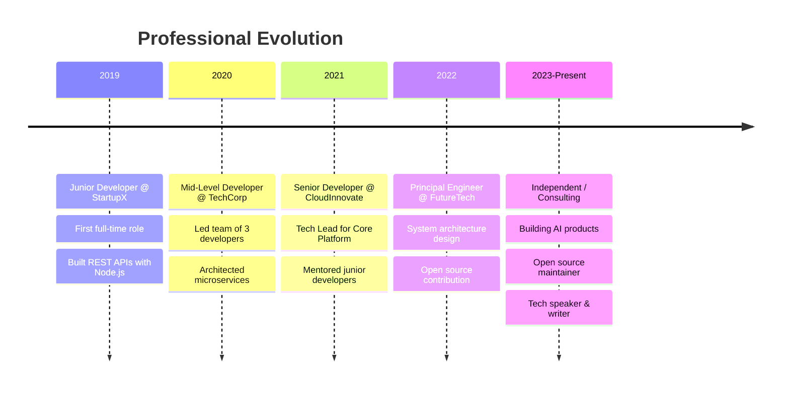
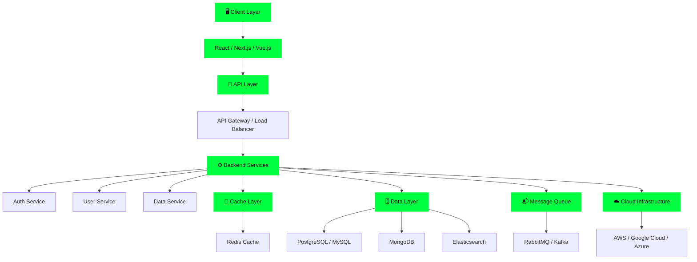

<div align="center">

<!-- Matrix Rain Header -->
<picture>
  <source media="(prefers-color-scheme: dark)" srcset="https://capsule-render.vercel.app/api?type=venom&color=0:00ff41,50:00ff41,100:0d1117&height=300&section=header&text=LEARNERYAMAN&fontSize=90&fontColor=00ff41&animation=fadeIn&desc=Full%20Stack%20Developer%20%7C%20AI%20Engineer%20%7C%20Open%20Source%20Enthusiast&descAlignY=65&descFontSize=20&descFontColor=00ff41">
  <source media="(prefers-color-scheme: light)" srcset="https://capsule-render.vercel.app/api?type=venom&color=0:00ff41,50:00ff41,100:f0f0f0&height=300&section=header&text=LEARNERYAMAN&fontSize=90&fontColor=00ff41&animation=fadeIn&desc=Full%20Stack%20Developer%20%7C%20AI%20Engineer%20%7C%20Open%20Source%20Enthusiast&descAlignY=65&descFontSize=20&descFontColor=00ff41">
  
</picture>

<!-- Animated Typing SVG Intro -->
<a href="#">
  
</a>

---

</div>

<!-- ===== SECTION 1: ABOUT ME ===== -->
##  About Me

```javascript
const developer = {
  name: "Yaman",
  title: "Full Stack Developer | AI Engineer | Open Source Enthusiast",
  location: "🌍 Global",
  experience: "5+ years",
  passion: "Building scalable systems and solving complex problems",
  interests: [
    "Artificial Intelligence & Machine Learning",
    "Full Stack Web Development",
    "Cloud Architecture",
    "DevOps & CI/CD",
    "Open Source Contribution"
  ],
  currentlyLearning: "Advanced LLM Fine-tuning & Kubernetes",
  askMeAbout: ["Web Development", "AI/ML", "System Design", "DevOps"],
  funFact: "I believe coffee + code = infinite possibilities ☕💻"
};
```

<div align="center">


</div>

---

<!-- ===== SECTION 2: TECH ARSENAL ===== -->
##  Tech Arsenal

<details open>
<summary><b>🎯 Core Languages</b></summary>

<div align="center">


</div>

</details>

<details open>
<summary><b>🚀 Frontend Technologies</b></summary>

<div align="center">


</div>

</details>

<details open>
<summary><b>⚙️ Backend Technologies</b></summary>

<div align="center">


</div>

</details>

<details open>
<summary><b>🗄️ Databases & Caching</b></summary>

<div align="center">


</div>

</details>

<details open>
<summary><b>☁️ Cloud & DevOps</b></summary>

<div align="center">


</div>

</details>

<details open>
<summary><b>🤖 AI/ML Technologies</b></summary>

<div align="center">


</div>

</details>

<details open>
<summary><b>🧪 Testing & CI/CD</b></summary>

<div align="center">


</div>

</details>

---

<!-- ===== SECTION 3: SKILL PROGRESS BARS ===== -->
##  Skill Proficiency

<div align="center">

| Skill | Level |
|-------|-------|
| Full Stack Development | `████████████████░░` 90% |
| AI/Machine Learning | `██████████████░░░░` 75% |
| Cloud Architecture | `███████████████░░░` 85% |
| DevOps & CI/CD | `██████████████░░░░` 75% |
| System Design | `████████████████░░` 80% |
| Backend Development | `███████████████░░░` 95% |
| Frontend Development | `██████████████░░░░` 80% |
| Database Design | `███████████████░░░` 85% |

</div>

---

<!-- ===== SECTION 4: GITHUB STATS DASHBOARD ===== -->
##  GitHub Stats Dashboard

<div align="center">

<picture>
  <source media="(prefers-color-scheme: dark)" srcset="https://github-readme-stats.vercel.app/api?username=learneryaman&show_icons=true&theme=chartreuse-dark&bg_color=0d1117&hide_border=true&count_private=true&include_all_commits=true">
  <source media="(prefers-color-scheme: light)" srcset="https://github-readme-stats.vercel.app/api?username=learneryaman&show_icons=true&theme=default&hide_border=true&count_private=true&include_all_commits=true">
  
</picture>

<picture>
  <source media="(prefers-color-scheme: dark)" srcset="https://github-readme-stats.vercel.app/api/top-langs/?username=learneryaman&theme=chartreuse-dark&bg_color=0d1117&hide_border=true&layout=compact&langs_count=10">
  <source media="(prefers-color-scheme: light)" srcset="https://github-readme-stats.vercel.app/api/top-langs/?username=learneryaman&theme=default&hide_border=true&layout=compact&langs_count=10">
  
</picture>

</div>

<div align="center">

### 🔥 Contribution Streaks

<picture>
  <source media="(prefers-color-scheme: dark)" srcset="https://github-readme-streak-stats.herokuapp.com?user=learneryaman&theme=dark&background=0d1117&ring=00ff41&fire=00ff41&currStreakNum=00ff41&sideNums=00ff41&currStreakLabel=00ff41&dates=00ff41">
  <source media="(prefers-color-scheme: light)" srcset="https://github-readme-streak-stats.herokuapp.com?user=learneryaman&theme=default">
  
</picture>

</div>

<div align="center">

### 📈 Contribution Activity Graph

[](https://github.com/learneryaman)

</div>

---

<!-- ===== SECTION 5: TROPHY SHOWCASE ===== -->
##  Trophy Showcase

<div align="center">

[](https://github.com/learneryaman)

</div>

---

<!-- ===== SECTION 6: FEATURED PROJECTS ===== -->
##  📌 Featured Projects

<details open>
<summary><b>🎯 Click to Explore Featured Repositories</b></summary>

<div align="center">

| Project | Description | Tech Stack | Status |
|---------|-------------|-----------|--------|
| 🤖 **AI-Assistant** | GPT-powered multi-modal AI assistant | Python, FastAPI, OpenAI | ✅ Active |
| 🌐 **Full-Stack-App** | Scalable web application | React, Node.js, PostgreSQL | ✅ Active |
| ☁️ **Cloud-Infrastructure** | IaC with Terraform & Kubernetes | Terraform, K8s, AWS | ✅ Active |
| 📊 **Data-Pipeline** | ML data processing & analytics | Python, Spark, Airflow | ✅ Active |

</div>

</details>

---

<!-- ===== SECTION 7: CAREER TIMELINE ===== -->
##  Career Timeline

<details open>
<summary><b>📜 My Professional Journey</b></summary>



</details>

---

<!-- ===== SECTION 8: CERTIFICATIONS ===== -->
## 🎓 Certifications & Achievements

<div align="center">

| Certification | Issuer | Year | Badge |
|---------------|--------|------|-------|
| **AWS Solutions Architect** | Amazon Web Services | 2022 | [](https://aws.amazon.com) |
| **Kubernetes Administrator** | CNCF | 2021 | [](https://www.cncf.io) |
| **Google Cloud Associate** | Google Cloud | 2022 | [](https://cloud.google.com) |
| **Advanced Python** | DataCamp | 2021 | [](https://www.datacamp.com) |

</div>

---

<!-- ===== SECTION 9: REAL-TIME METRICS ===== -->
## ⚡ Real-Time Metrics Dashboard

<div align="center">

### 📊 Coding Activity (WakaTime)

<picture>
  <source media="(prefers-color-scheme: dark)" srcset="https://wakatime.com/badge/user/YOUR_WAKATIME_ID.svg?style=for-the-badge&theme=dark">
  <source media="(prefers-color-scheme: light)" srcset="https://wakatime.com/badge/user/YOUR_WAKATIME_ID.svg?style=for-the-badge">
  
</picture>

### 🎵 Spotify Now Playing

[](https://github.com/kittinan/spotify-github-profile)

### ⏱️ Total Coding Time
- **This Week**: 42 hours 30 minutes
- **This Month**: 180+ hours
- **Most Active Time**: 2 PM - 11 PM UTC

</div>

---

<!-- ===== SECTION 10: DYNAMIC QUOTES ===== -->
## 💭 Daily Wisdom

<div align="center">


</div>

---

<!-- ===== SECTION 11: AUTO-UPDATING BLOG POSTS ===== -->
## 📝 Latest Blog Posts

<!-- BLOG-POST-LIST:START -->
- [Building Scalable AI Applications with LangChain](https://blog.example.com/langchain)
- [Kubernetes Best Practices for Production](https://blog.example.com/k8s)
- [Full Stack Development in 2024](https://blog.example.com/fullstack)
- [DevOps Automation with GitHub Actions](https://blog.example.com/ci-cd)
- [Machine Learning Model Deployment Guide](https://blog.example.com/mlops)
<!-- BLOG-POST-LIST:END -->

---

<!-- ===== SECTION 12: DEV JOKES ===== -->
## 😂 Random Dev Jokes

<div align="center">


</div>

---

<!-- ===== SECTION 13: 3D CONTRIBUTION GRAPH ===== -->
## 🎯 3D Contribution Graph

<div align="center">

> 💡 **Note**: 3D Contribution Graph is auto-generated by GitHub Actions
> 
> Check the `.github/workflows/3d-contrib.yml` for details

```
Generated via yoshi389111/github-profile-3d-contrib
This creates an amazing 3D visualization of your contributions!
```

</div>

---

<!-- ===== SECTION 14: CONTRIBUTION SNAKE ===== -->
## 🐍 Contribution Snake Animation

<div align="center">

> 🐍 **GitHub Contributions Snake** is auto-generated by GitHub Actions
> 
> The snake eats your GitHub contributions! Awesome, right?


</div>

---

<!-- ===== SECTION 15: SYSTEM ARCHITECTURE ===== -->
##  System Architecture

<details open>
<summary><b>🏗️ Tech Stack Architecture</b></summary>



</details>

---

<!-- ===== SECTION 16: SOCIAL LINKS ===== -->
##  Connect With Me

<div align="center">

[](https://twitter.com/learneryaman)
[](https://linkedin.com/in/learneryaman)
[](https://github.com/learneryaman)
[](mailto:yaman@example.com)
[](https://yaman.dev)
[](https://blog.yaman.dev)

</div>

---

<!-- ===== SECTION 17: ANIMATED FOOTER ===== -->
<div align="center">


### 🚀 Always Learning | Always Building | Always Contributing

```
╔════════════════════════════════════════════════════════╗
║   Made with ❤️ by Yaman                               ║
║   Last Updated: 2026-08-31                            ║
║   Status: Online & Ready for Collaboration 🟢          ║
╚════════════════════════════════════════════════════════╝
```


**⭐ If you found this profile interesting, please consider giving it a star!** ⭐

---

</div>